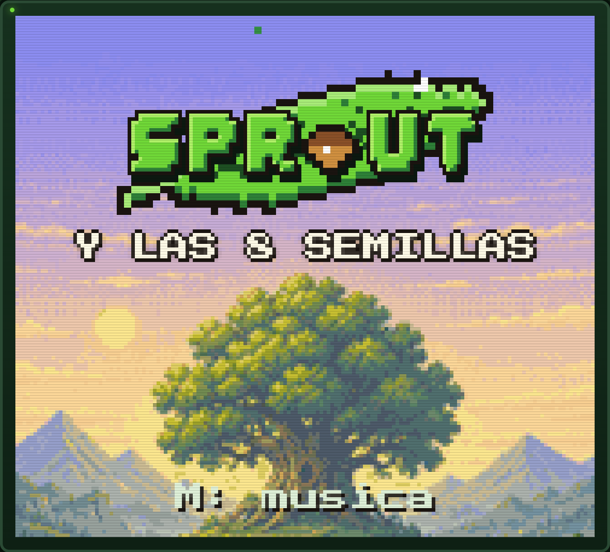
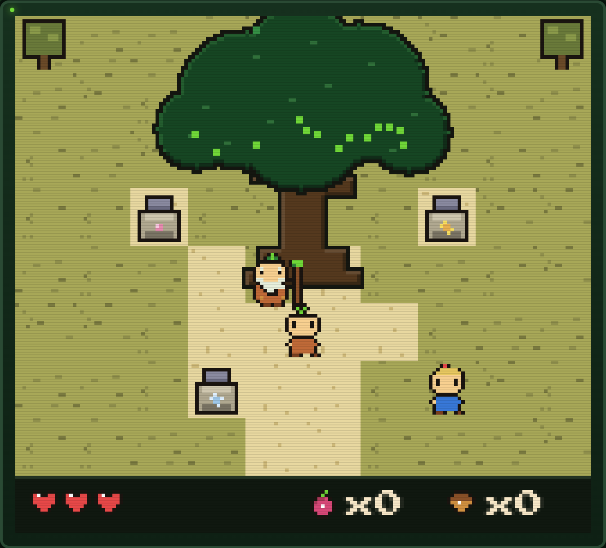
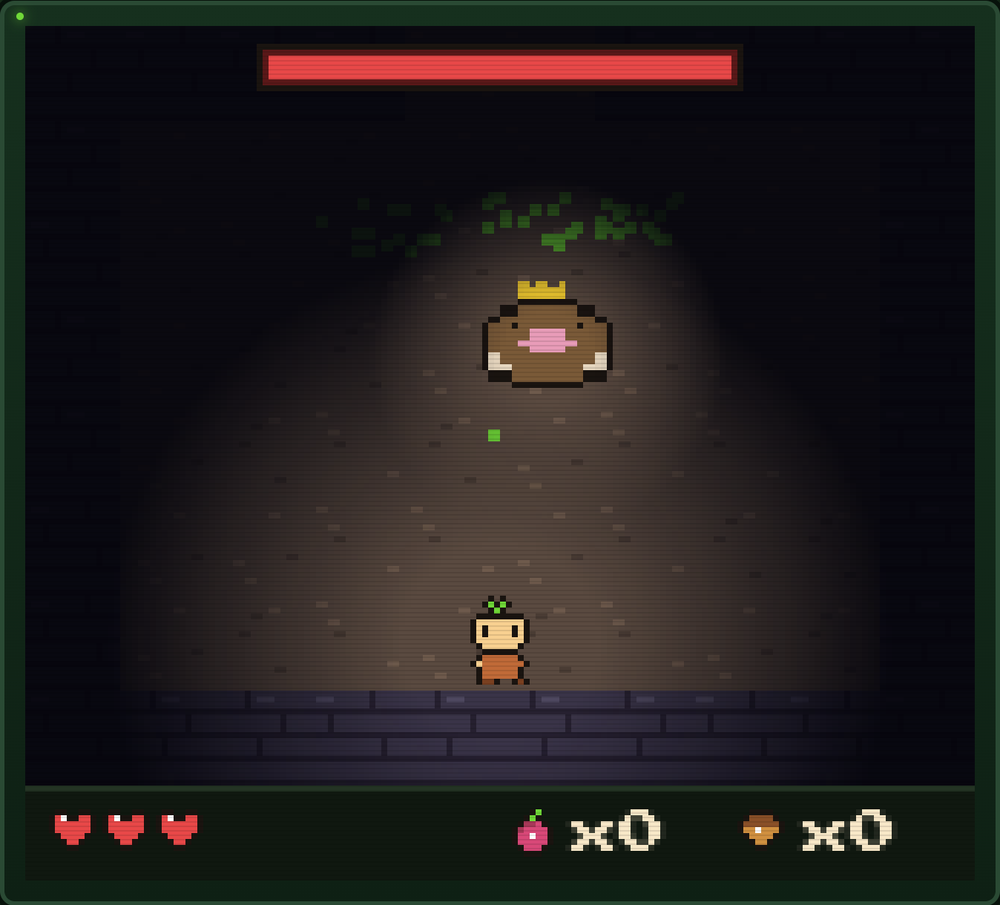
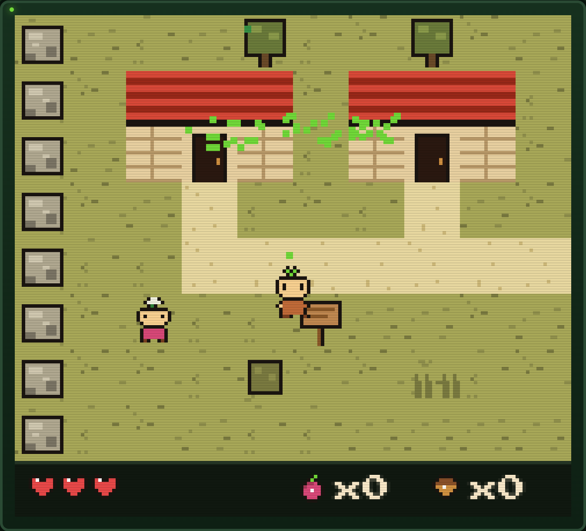

<div align="center">



# SPROUT · y las 8 semillas

**Una microaventura tipo Zelda, estilo Game Boy, hecha a mano con rectángulos.**

[](https://gavilanbe.github.io/sprout-game/)


</div>

---

## 🌱 Qué es esto

**SPROUT** es un Zelda-like diminuto que corre en cualquier navegador. Resolución
real de Game Boy (160×144), tiles de 16 px, paleta GBC y banda sonora *chiptune*
generada en vivo con WebAudio. **Cero dependencias, cero paso de build**: es
HTML, un `<canvas>` y JavaScript repartido en módulos que se cargan en orden.

Cabe en unos pocos kilobytes de código y, aun así, tiene mundo abierto por
pantallas, mazmorras, jefes, tienda, sistema de guardado en 3 ranuras, clima por
región, diálogos con retrato estilo *Golden Sun* y un final que abre el siguiente
capítulo.

## 📖 La historia

> El **Gran Roble** que cobija el valle se ha quedado gris y callado: el **Viento**,
> su propio hermano, le robó las **8 semillas doradas** y las desperdigó por los
> rincones para que nadie volviera a juntarlas.
>
> Tú eres **Sprout**, la novena bellota. Alza la **Hoja Ancestral**, recupera las
> ocho semillas y devuélvele la voz al Roble.

Y una regla que define todo el juego:

> **Ningún jefe muere.** A 2 de vida se rinden y te ceden su tesoro cuando les
> hablas. No los vences: los recuerdas.

## 🎮 Cómo se juega

| Tecla | Acción |
|---|---|
| `← ↑ ↓ →` | Mover |
| `Z` | Hoja / hablar / interactuar |
| `X` | Plantar bellota-bomba |
| `↵ Enter` | Abrir el zurrón |
| `M` | Música on/off |

En móvil aparecen mandos táctiles automáticamente. También funciona con gamepad.

> 💡 Búscate los arbustos que **brillan**: esconden cosas. Y habla con todo el mundo.

## 📸 Capturas

| La plaza y el Gran Roble | Un jefe (El Topo Real) | El Barrio del Roble |
|:--:|:--:|:--:|
|  |  |  |

## ▶️ Jugar

La forma más fácil: **[gavilanbe.github.io/sprout-game](https://gavilanbe.github.io/sprout-game/)**.

### En local

No hay que instalar ni compilar nada. Solo necesitas servirlo como estático
(el `fetch` del service worker requiere `http://`, no `file://`):

```bash
git clone https://github.com/gavilanbe/sprout-game.git
cd sprout-game
python3 -m http.server 8741
# abre http://localhost:8741
```

Sirve igual con `npx serve`, `php -S`, o cualquier estático. Al ser **PWA**,
tras la primera carga se puede jugar sin conexión.

## 🛠️ Bajo el capó

- **Vanilla JS, sin framework ni bundler.** Los módulos de `js/` son scripts
  clásicos que comparten ámbito global y se cargan **en orden** desde
  `index.html` (datos primero, lógica después, arranque al final).
- **Render:** un único `<canvas>` 160×144 escalado a enteros, `image-rendering: pixelated`.
- **Sprites y tiles** dibujados a mano por código (literalmente, rectángulos).
- **Audio:** secuenciador *chiptune* propio sobre WebAudio (`beep`/`noise`), sin
  ningún archivo de sonido.
- **Persistencia:** `localStorage`, 3 ranuras de guardado.
- **PWA:** service worker *network-first* para el código, *cache-first* para
  recursos → siempre fresco y jugable offline.

¿Quieres tocar el código? **[`ARCHITECTURE.md`](ARCHITECTURE.md)** explica qué
vive en cada módulo y trae recetas para añadir una pantalla, un enemigo, un
jefe, una misión o una pista musical.

## ✨ Créditos

Diseñado y programado por **[Fable](https://www.anthropic.com)**, el modelo de
Claude de Anthropic — arte, código, música, lore y diseño de niveles incluidos.
Hecho a mano con rectángulos, una bellota y mucho cariño.

Dirigido y publicado por [**@gavilanbe**](https://github.com/gavilanbe).

## 📄 Licencia

[MIT](LICENSE) — úsalo, ábrelo, plántalo donde quieras.

<div align="center"><sub>HECHO A MANO CON RECTÁNGULOS · 2026</sub></div>
