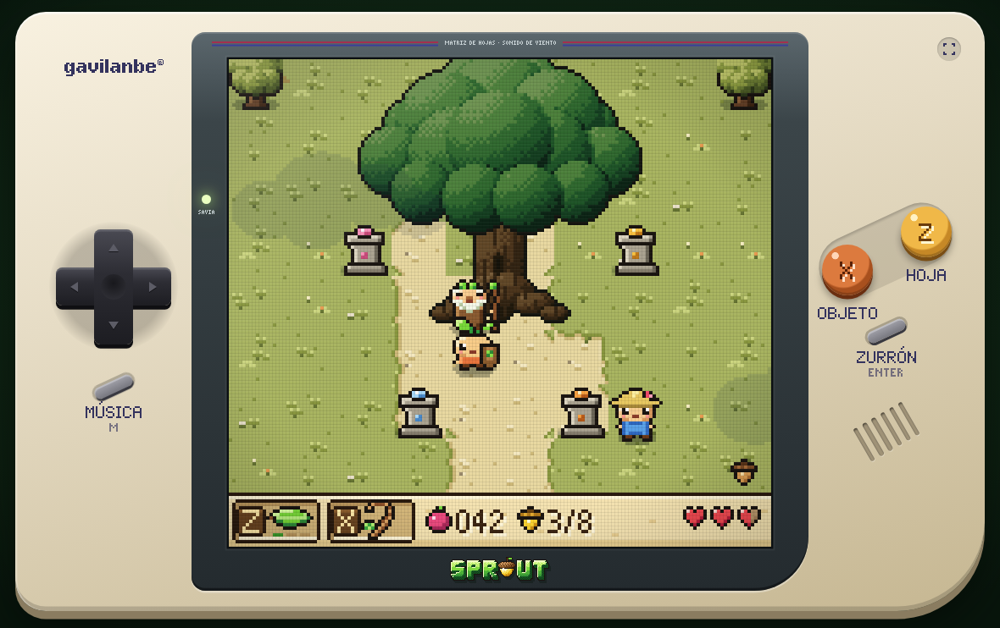
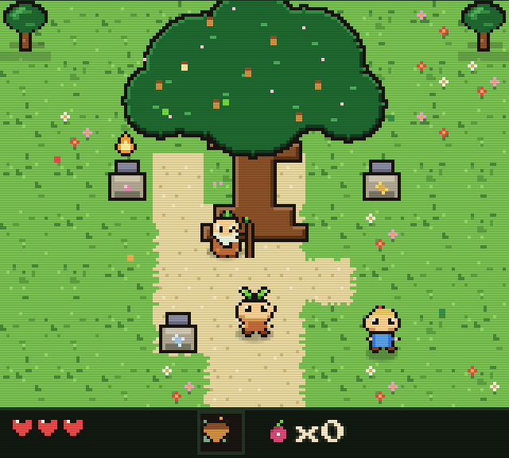
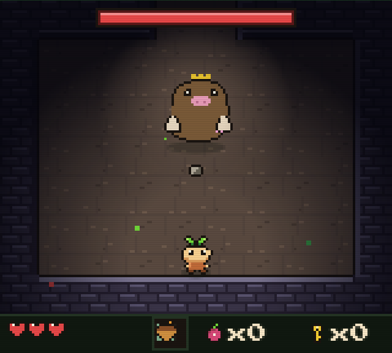
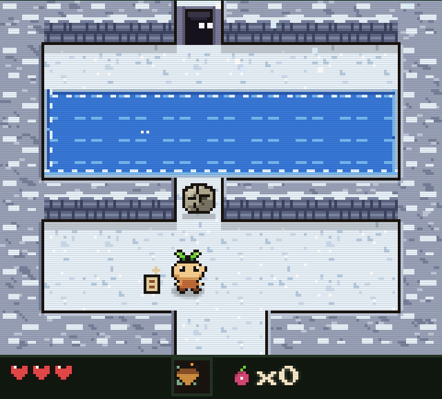
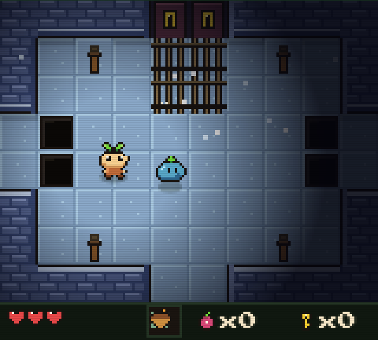
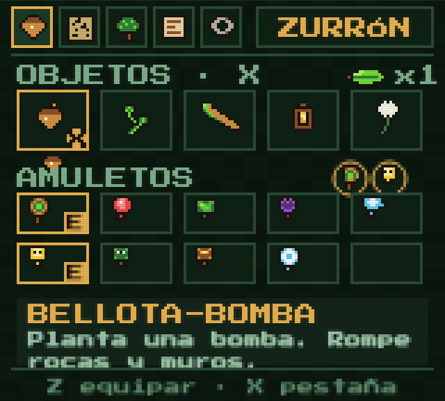
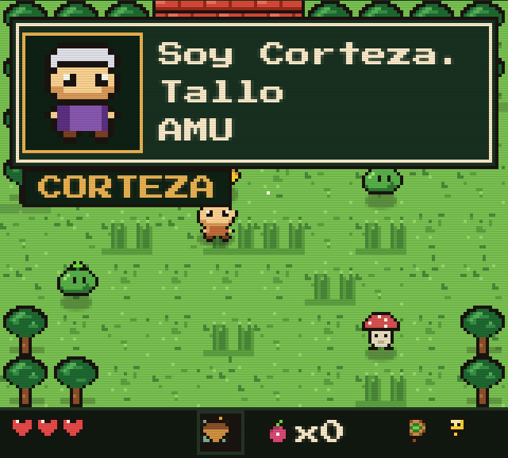
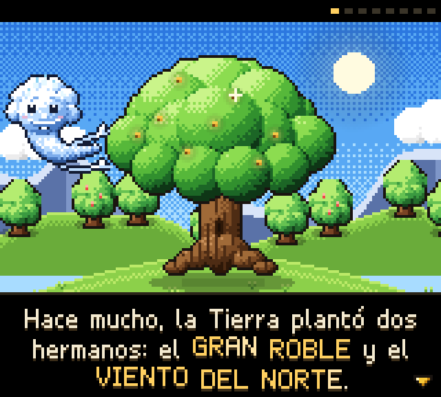
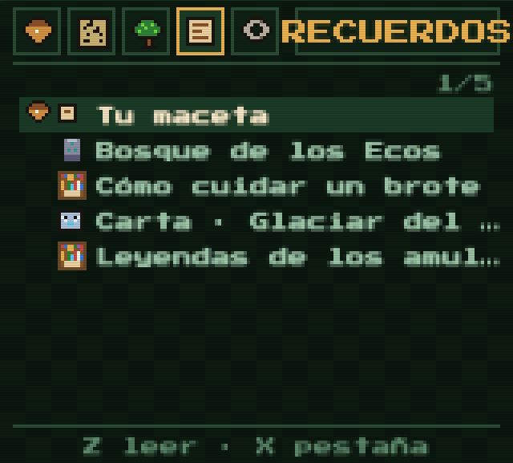

<div align="center">



# SPROUT · y las 8 semillas

**Un Zelda-like estilo Game Boy Color, hecho a mano con rectángulos.**

[](https://gavilanbe.github.io/sprout-game/)


</div>

---

## 🌱 Qué es esto

**Nuevo experimento:** [La primera semilla](slice.html), una demo independiente
de tres pantallas con sprites generados por imagen, animaciones de caminar y
atacar, una misión completa y visor de assets. Funciona a 320 × 288 con escalado
entero. Los másteres y las hojas listas para reutilizar se incluyen en
`assets/slice/`. [Detalles, prompts y resolución](docs/slice/README.md).

**SPROUT** es una aventura tipo *Link's Awakening* que corre en cualquier navegador.
Resolución real de Game Boy (160×144), tiles de 16 px, paleta GBC y banda sonora
*chiptune* generada en vivo con WebAudio. **Cero dependencias, cero paso de build**:
HTML, un `<canvas>` y JavaScript en módulos que se cargan en orden.

- **87 pantallas**: el Valle Raíz, las montañas del norte, las marismas del otoño,
  un glaciar, una cala escondida, nueve secretos (cuevas tras grietas, un manantial,
  una madriguera helada, un tesoro enterrado…) y **cuatro mazmorras** largas, con
  emboscadas que cierran las puertas, llaves en cualquier orden, mapa y brújula.
- **Cuatro guardianes que no mueren** (el Topo Real, la Reina Avispa, el Ciervo de
  Ámbar y el Viento del Norte), por fases y cada uno exige la herramienta de su
  mazmorra, y **cuatro minijefes** (el Escarabajo Rey, el Zángano Capitán, el
  Espantapájaros y el Guardián de Hielo). Tras el final, **el Eco de los
  Guardianes**: sus ecos, uno detrás de otro.
- **Siete herramientas** — la Hoja Ancestral, la Bellota-bomba, la Raíz-gancho, la
  Vaina voladora, el Farol de brasa, el Molinillo y el Vilano — y **nueve amuletos** equipables
  (dos a la vez) que cambian cómo juegas.
- **Backtracking de verdad**: cada herramienta reabre el valle (rocas agrietadas,
  islas, agujeros, cuevas oscuras) con corazones, cuartos de corazón y amuletos.
- **Puzles**: bloques sobre placas, pulsadores, antorchas que abren verjas,
  cristales que alternan bloques rojos y azules, hielo resbaladizo, llaves pequeñas
  y llaves grandes.
- **Lore**: un prólogo ilustrado, el diario del Roble (diez páginas), piedras
  rúnicas, libros en las estanterías, las cinco **Cartas del Viento** que nadie
  abrió y guardianes que siguen hablando después de la tregua. Todo se relee en
  la pestaña de Recuerdos.
- **Cada arma tiene su momento**: Sprout la atrapa al vuelo y la alza, el mundo
  se congela en una viñeta tramada con los colores de esa arma (franjas de cine,
  líneas de velocidad, el arma en grande con su nombre) y una frase del valle,
  como «Dentro de cada bellota duerme un roble con prisa». Dos segundos y medio;
  Z lo acelera.
- Mejoras que se notan: la Hoja en tres temples (la última lanza un rayo de hoja),
  el Remolino y el **Gran Remolino**, el **Escudo de Roble** que devuelve disparos,
  bellotas-bomba contadas con **belloteros** que rebrotan y el zurrón de bellotas.
- Tienda de Tilo, cabaña de Corteza, el pozo de los deseos, una **cadena de
  trueques** de ocho pasos, **pesca** con Moss, 22 tipos de bicho, clima por región,
  cinemáticas de estación, un final en cuatro planos y las estaciones girando.
- **Se juega en una consola**: la página es una portátil de *gavilanbe* (arranca
  con su logo bajando como el de la Game Boy y un «ding»), con la pantalla a
  píxeles exactos y rejilla de LCD, el LED de la savia (late al guardar, se pone
  rojo con poca vida), botones que se hunden al pulsar el teclado o el mando y
  cuatro colores de carcasa (marfil, salvia, baya y uva).
- **En el móvil** la consola ocupa toda la pantalla, en vertical (como una GBC) o
  en horizontal: cruceta que se desliza entre direcciones, botones de pulgar que
  no se sueltan si el dedo se desvía, vibración al pulsar y pantalla completa.
- Opciones: volumen de música y efectos, dificultad, teclas reasignables,
  vibración y color de la consola.
- HUD con paneles biselados: corazones que palpitan cuando quedan pocos, ranura
  Z con la Hoja y su nivel, ranura X con el objeto (destella al usarlo),
  contadores que rebotan, burbuja «Z» sobre lo que puedes usar y cartel con el
  nombre de cada lugar al descubrirlo.
- Un **zurrón de cuero** de verdad: al abrirlo el mundo se queda quieto y
  apagado detrás, la bolsa cae con un golpe seco y polvo, salta la hebilla, se
  levanta la solapa y todo salta a su sitio; al cerrarlo sale volando mientras
  el juego ya sigue. Cinco pestañas (objetos; amuletos que vuelan a su engarce;
  el **equipo** con el nivel de la Hoja, el escudo, el remolino y el zurrón de
  bellotas; mapa con **miniaturas reales**; el valle; recuerdos y ajustes),
  placa de latón que gira, cursor que planea y ficha de pergamino. Guardado en
  3 ranuras con capítulo y tiempo, mandos táctiles, gamepad y PWA.

## 🎨 Arte

Todo el arte se genera en el arranque a partir de texto y rectángulos:

- **Autotiles**: el agua dibuja su orilla, los acantilados muestran cara y cornisa,
  los muros de mazmorra se biselan hacia las salas, los caminos y la arena se
  mezclan con la hierba.
- **Biomas**: primavera, verano, otoño, invierno y el valle mustio comparten mapas
  y cambian de paleta según la historia.
- Sprites de 16 px con contorno, dos fotogramas y poses de ataque y objeto en alto;
  minijefes de 24 px y guardianes de 32 px con retrato en el diálogo.
- Oscuridad con luz de farol y antorchas, sombras bajo cada actor, estelas de la
  Hoja, números de daño, sacudida de pantalla y *hit-stop*.
- Cajas de texto con piel según quién habla: madera para los carteles, piedra
  para las runas, pergamino para diarios y libros, papel azul para las cartas.
  Las palabras clave se iluminan solas, el texto respira en la puntuación, el
  retrato habla y las preguntas tienen cursor.
- Marchitarse es una escena: el mundo pierde el color, Sprout se seca y se
  deshace en polvo, y sólo una hoja verde baja planeando junto a su semilla. La
  semilla se hunde en la tierra hasta las raíces del Gran Roble y, en un sueño
  de anillos que ondulan con los colores de la estación, el Roble te habla
  (según dónde y cuántas veces has caído, con una pista si te venció un jefe):
  «¿Lo intentamos otra vez?». Si dices que sí, la luz se recoge en una semilla
  a la entrada de la pantalla (o de la mazmorra), germina al son del motivo y
  Sprout sale de un salto; si no, se guarda y vuelves al título. Z lo acelera.

| La plaza del Gran Roble | El Topo Real |
|:--:|:--:|
|  |  |

| El sendero del pico | El Templo de la Cima |
|:--:|:--:|
|  |  |

| El zurrón | Corteza, la de los amuletos |
|:--:|:--:|
|  |  |

| El prólogo ilustrado | Los recuerdos |
|:--:|:--:|
|  |  |

## 🎵 Música

Catorce pistas chiptune generadas en vivo con WebAudio: cuatro voces por pista
(melodía con vibrato y eco, contramelodía, bajo de triángulo y batería del canal
de ruido), ondas de pulso al 12,5 % y 25 % como en la Game Boy y un compresor de
salida. Toda la banda sonora comparte dos ideas: el **motivo de Sprout** («el brote
que trepa», la-si-do-re-mi), que abre el título y el vals del valle y se vuelve
menor en los guardianes; y la **nana de Raíz**, que suena en casa y crece hasta
llenar los créditos. Título, valle, casa, tienda, norte helado, marismas, cueva,
templo, cima, guardián, minijefe, gruta, marchitarse y créditos.

## 📖 La historia

El Viento del Norte robó las **8 semillas doradas** del Gran Roble y las esparció
por el valle. Sin ellas, todo el verdor se apaga. Eres **Sprout**, un brote recién
despierto en una maceta. Raíz, el anciano de la plaza, te manda a por la **Hoja
Ancestral**… y de ahí, a cuatro mazmorras donde duermen las reliquias de las
estaciones: la **Brasa de Primavera**, la **Lágrima de Verano**, la **Hoja de Ámbar**
y el **Copo Eterno**.

**Ningún guardián muere.** Cuando se rinden, acércate y habla con Z. Y si vuelves
a visitarlos, tendrán algo que decirte.

## 🎮 Cómo se juega

| Tecla | Acción |
|---|---|
| `← ↑ ↓ →` / `WASD` | Mover |
| `Z` / espacio | Hoja · hablar · abrir · recoger |
| Mantener y soltar `Z` | Remolino (cuando lo aprendas de Tilo) |
| `X` | Usar el objeto equipado (bomba, gancho, vaina, farol, vilano) |
| `Enter` / `Escape` | Abrir y cerrar el zurrón |
| `X` en el zurrón | Cambiar de pestaña (zurrón · mapa · valle · recuerdos · ajustes) |
| `M` | Música on/off |

En el zurrón, `Z` sobre un objeto lo equipa en `X`; `Z` sobre un amuleto lo pone o
lo quita (dos ranuras); la fila de EQUIPO enseña lo que ya llevas siempre
puesto y, con `?`, lo que aún te falta. Los botones de la consola también se pueden pulsar con el ratón. En el móvil,
la consola entera es el mando. En mando: A = Z, B = X,
Start = zurrón.

## 🛠 Desarrollo

```sh
python3 -m http.server 8741    # cualquier estático vale
```

Sin build. El orden de los `<script>` de `index.html` es el orden de ejecución.
[ARCHITECTURE.md](ARCHITECTURE.md) explica los módulos y cómo añadir pantallas,
tiles, enemigos o misiones. [docs/DISEÑO.md](docs/DISEÑO.md) recoge la progresión,
los puzles y sus soluciones (spoilers).

Pruebas en navegador real (Playwright):

```sh
npm install && npx playwright install chromium && npm test
```

## 📜 Licencia

MIT. Hecho a mano con rectángulos por Nahuel Gavilán.
