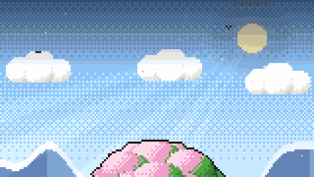
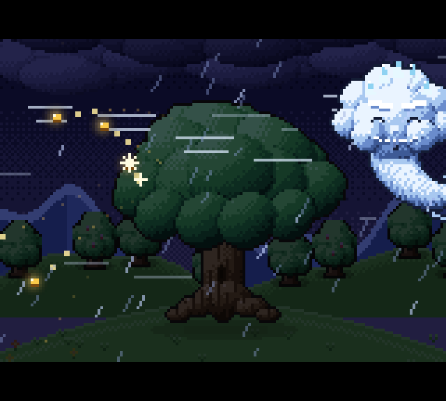
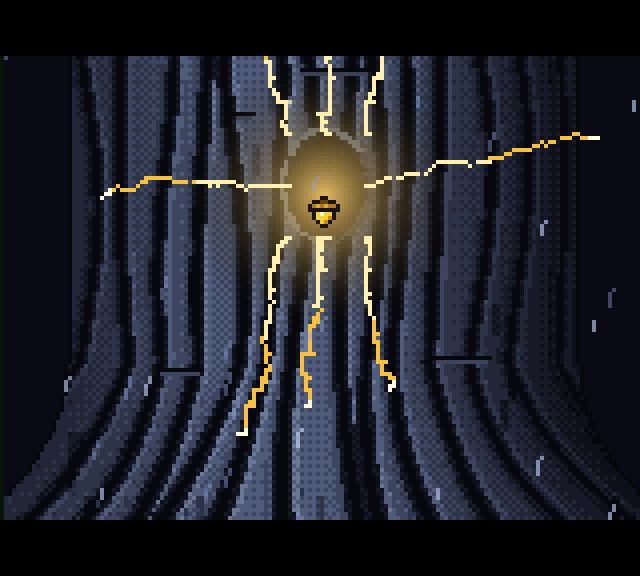
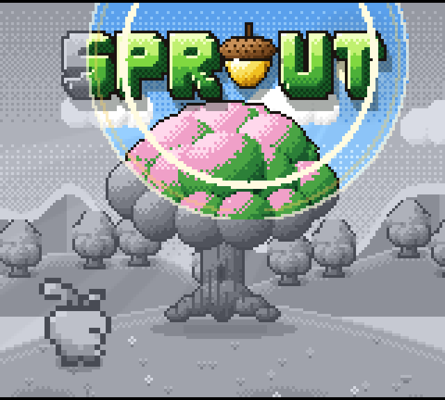
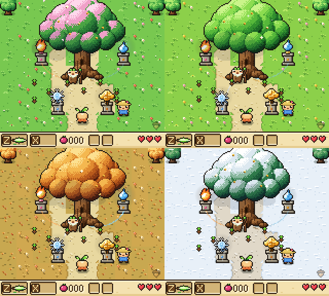
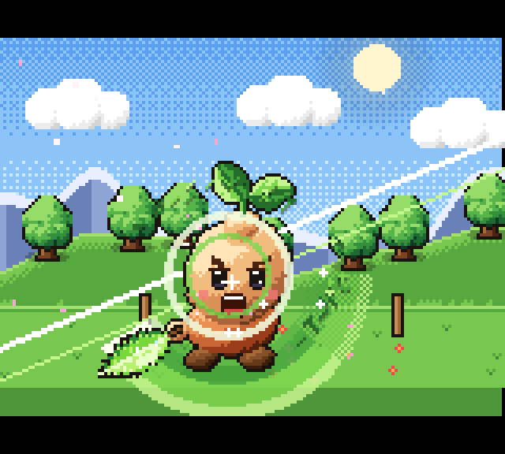
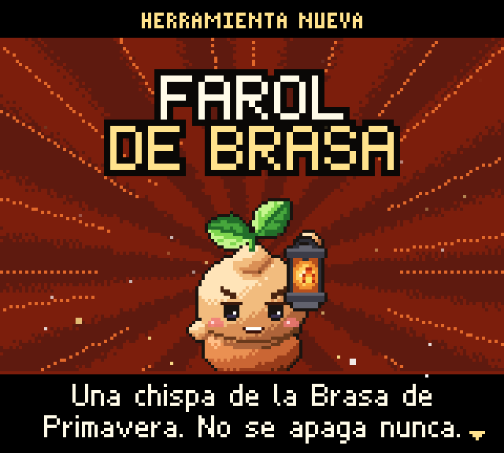
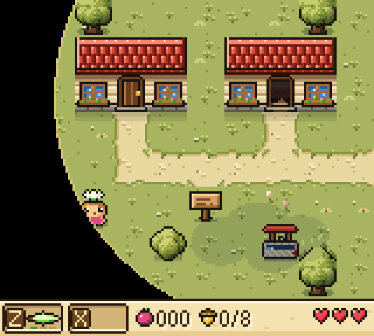
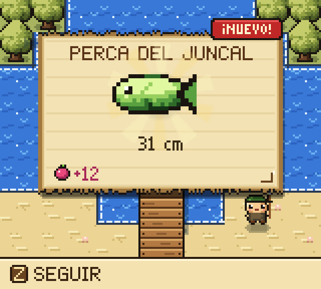
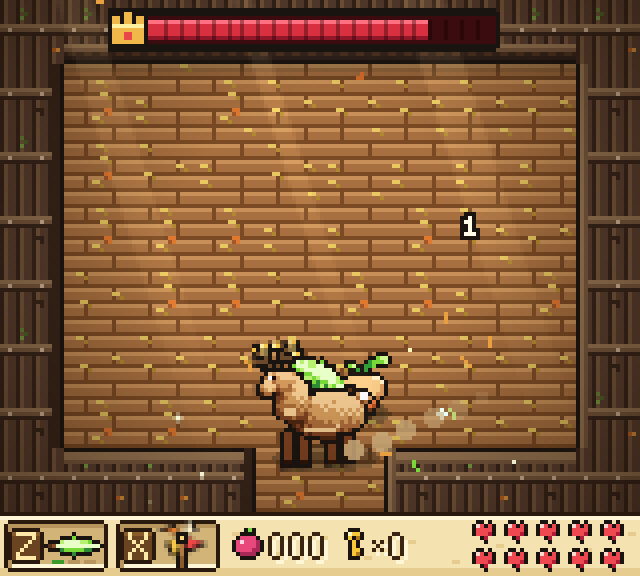

<div align="center">

<a href="https://gavilanbe.github.io/sprout-game/"></a>

# SPROUT · y las 8 semillas

**Un Zelda-like estilo Game Boy Color, hecho a mano con rectángulos.**<br>
Un valle entero por explorar, ocho armas, cuatro mazmorras y un año que vuelve a girar.

[](https://gavilanbe.github.io/sprout-game/)
[](https://gavilanbe.github.io/sprout-game/docs/media/sprout-trailer.mp4)
[](https://gavilanbe.github.io/sprout-game/docs/media/sprout-trailer-vertical.mp4)


</div>

---

## 🌱 Qué es esto

**SPROUT** es una aventura tipo *Link's Awakening* que corre en cualquier navegador,
del ordenador al móvil. Resolución real de Game Boy (160×144), tiles de 16 px,
paleta GBC y una banda sonora *chiptune* que se genera en vivo con WebAudio.
**Cero dependencias, cero paso de build**: HTML, un `<canvas>` y JavaScript en
módulos que se cargan en orden. Hasta el arte se dibuja en el arranque a partir de
texto y rectángulos.

<div align="center">

</div>

| | |
|---|---|
| 🗺️ **87 pantallas** | El Valle Raíz, las montañas del norte, las marismas, un glaciar, una cala escondida y nueve secretos |
| ⚔️ **8 armas y herramientas** | Hoja Ancestral, Bellota-bomba, Raíz-gancho, Vaina voladora, Farol de brasa, Vilano, Escudo de corteza y Molinillo, cada una con su cinemática |
| 🏰 **4 mazmorras** | Largas, con emboscadas que cierran las puertas, llaves en cualquier orden, mapa y brújula |
| 👑 **4 guardianes + 4 minijefes** | Que no mueren: se rinden y te hablan. Tras el final, el Eco de los Guardianes |
| 🍂 **4 estaciones** | El valle se viste de verdad con la estación que le devuelves |
| 🎵 **19 pistas** | Chiptune en vivo, con un motivo que atraviesa toda la banda sonora |
| 🧿 **10 amuletos** | Equipables de dos en dos, cambian cómo juegas |
| 📲 **PWA** | Se instala y funciona sin conexión, en vertical o en horizontal |

## ✨ Lo nuevo

### El título: «la semilla que el Viento no encontró»

Una intro corta (va sin música, la leyenda la cuenta el prólogo), pero que dice
mucho. Un relámpago descubre al **Viento del Norte** entre las nubes; baja
aullando y le arranca al Gran Roble sus ocho semillas. En la corteza gris late
una que **no encontró**: se esconde cuando pasa su sombra, vuelve a latir,
revienta y sube a encajarse como la **O del logo**. Justo entonces entra el tema y
el color vuelve al valle en una ola que sale de ella: las letras brincan al
pasarles, el Roble florece, Sprout se despierta y a la bellota le salen sus dos
hojas. Ocho lucecitas lejanas marcan las semillas que tendrás que buscar.

| La tormenta | La semilla escondida | La ola de color | El título |
|:--:|:--:|:--:|:--:|
|  |  |  |  |

El título **vive al compás de la música**: la bellota late en cada tiempo, las
letras hacen la ola, pasan ráfagas que las mecen, y el año gira una estación por
frase del tema (primavera y verano los trae el Roble floreciendo; otoño e
invierno, el Viento soplando). El logo se viste con cada estación, nieve incluida.
Sprout saluda, baila, tirita en invierno, se sacude la hoja seca que le cae en
otoño, mira hacia donde pulses y salta con **Z**.

### El Gran Roble, vivo, y las estaciones de verdad

El Roble de la plaza respira, se mece, suelta hojas cuando habla Raíz y lleva la
estación del valle. Entregar una reliquia es un **rito**: vuela a **su** altar,
la raíz enciende un camino de luz hasta el tronco y la estación sale del Roble y
recorre las pantallas reales del valle, que desde ese momento se ven cambiadas.

| El Roble en la plaza | Las cuatro estaciones |
|:--:|:--:|
|  |  |

### Cada arma, su cinemática

Con la ambición de la intro de *Oracle of Seasons*: Sprout dibujado en grande
(por piezas, con párpados, cejas y bocas) blande el arma en su escenario, con
anticipación, golpe congelado y fotograma en negativo; luego un primer plano
animado y un título con su nombre y una frase del valle. Después, ya en el
juego, el gesto de cogerla.

| La Hoja Ancestral | El Farol de brasa |
|:--:|:--:|
|  |  |

### El Viento del Norte, un personaje

Hermano del Roble: corona de carámbanos, cejas de escarcha, bigote de nube y una
cola de viento en forma de coma, con seis estados de ánimo dibujados a su tamaño
(tormenta, aúlla, sopla, triste, en calma y feliz). Es el mismo en el título, el
prólogo, su cima, su eco y el final.

### Puertas con peso

Entrar en una casa, una cueva o una escalera ya no es un salto: Sprout entra
andando, un iris nítido se cierra, cambia de pantalla a oscuras y sale andando
por el otro lado, con el control bloqueado lo justo.

<div align="center"></div>

## 🎬 El tráiler

<div align="center">

**[▶ Tráiler 16:9](https://gavilanbe.github.io/sprout-game/docs/media/sprout-trailer.mp4)** · 1920×1080 · 48 s &nbsp;&nbsp;|&nbsp;&nbsp;
**[▶ Reel 9:16](https://gavilanbe.github.io/sprout-game/docs/media/sprout-trailer-vertical.mp4)** · 1080×1920 · 48 s

</div>

No está editado en ningún programa: lo **renderiza el propio juego**. Un
compositor se inyecta en la página, pone en escena partidas reales, las graba
fotograma a fotograma y las monta a tempo con la música del juego, con los
efectos sonando justo donde se ven. Sin spoilers de la historia. Para volver a
generarlo (hace falta `ffmpeg` para los MP4):

```sh
npm run trailer    # los dos formatos → tools/trailer/out/
```

Cómo está hecho: [tools/trailer/README.md](tools/trailer/README.md).

## 🎮 El juego

- **87 pantallas**: el Valle Raíz, las montañas del norte, las marismas del otoño,
  un glaciar, una cala escondida, nueve secretos (cuevas tras grietas, un manantial,
  una madriguera helada, un tesoro enterrado…) y **cuatro mazmorras** largas, con
  emboscadas que cierran las puertas, llaves en cualquier orden, mapa y brújula.
- **Cuatro guardianes que no mueren** (el Topo Real, la Reina Avispa, el Ciervo de
  Ámbar y el Viento del Norte), por fases y cada uno exige la herramienta de su
  mazmorra, y **cuatro minijefes** (el Escarabajo Rey, el Zángano Capitán, el
  Espantapájaros y el Guardián de Hielo). Tras el final, **el Eco de los
  Guardianes**: sus ecos, uno detrás de otro.
- **Ocho armas y herramientas** — la Hoja Ancestral, la Bellota-bomba, la
  Raíz-gancho, la Vaina voladora, el Farol de brasa, el Vilano, el Escudo de
  corteza y el Molinillo — y **diez amuletos** equipables (dos a la vez).
- **Backtracking de verdad**: cada herramienta reabre el valle (rocas agrietadas,
  islas, agujeros, cuevas oscuras) con corazones, cuartos de corazón y amuletos.
- **Puzles**: bloques sobre placas, pulsadores, antorchas que abren verjas,
  cristales que alternan bloques rojos y azules, hielo resbaladizo, hojarasca que
  esconde agujeros, llaves pequeñas y llaves grandes.
- **Lore**: un prólogo de ocho planos (dos hermanos, el año que giraba, el olvido,
  la tormenta…), el diario de Raíz, piedras rúnicas, libros en las estanterías,
  las cinco **Cartas del Viento** que nadie abrió y guardianes que siguen hablando
  después de la tregua. Todo se relee en la pestaña de Recuerdos.
- **La Hoja es una hoja**: nervios, borde dentado y peciolo; se dobla al coger
  impulso, enseña el envés al girar y da un latigazo al final, suelta hojitas y
  rocío, suena a hojas y salpica savia al golpear.
- Mejoras que se notan: la Hoja en tres temples (la última lanza un rayo de hoja),
  el Remolino y el **Gran Remolino**, el **Escudo de Roble** que devuelve disparos,
  bellotas-bomba contadas con **belloteros** que rebrotan y el zurrón de bellotas.
- Tienda de Tilo, cabaña de Corteza, el pozo de los deseos, una **cadena de
  trueques** de ocho pasos, **pesca** con Moss (y el Viejo Bigotes), 22 tipos de
  bicho, clima por región y un final en cuatro planos con el año girando.
- **Marchitarse es una escena**: el mundo pierde el color, Sprout se seca y se
  deshace en polvo, y la semilla baja hasta las raíces del Gran Roble, que te
  habla en sueños: «¿Lo intentamos otra vez?».
- Un **zurrón de cuero** de verdad como menú: cae con un golpe seco, salta la
  hebilla, se levanta la solapa; cinco pestañas (objetos, amuletos que vuelan a
  su engarce, equipo, mapa con miniaturas reales, el valle, recuerdos y ajustes).

| Pesca con Moss | El Ciervo de Ámbar |
|:--:|:--:|
|  |  |

| El sendero del pico | El Templo de la Cima |
|:--:|:--:|
|  |  |

| El zurrón | Corteza, la de los amuletos |
|:--:|:--:|
|  |  |

| El prólogo | Los recuerdos |
|:--:|:--:|
|  |  |

## 🕹 La consola

La página es una portátil de *gavilanbe*: arranca con su logo bajando como el de
la Game Boy y un «ding», con la pantalla a píxeles exactos y rejilla de LCD, el
LED de la savia (late al guardar, se pone rojo con poca vida), botones que se
hunden al pulsar el teclado o el mando y cuatro colores de carcasa (marfil,
salvia, baya y uva). **En el móvil** la consola ocupa toda la pantalla, en
vertical (como una GBC) o en horizontal: cruceta que se desliza entre
direcciones, botones de pulgar que no se sueltan si el dedo se desvía, vibración
y pantalla completa.

## 🎨 Arte

Todo el arte se genera en el arranque a partir de texto y rectángulos:

- **Autotiles**: el agua dibuja su orilla, los acantilados muestran cara y cornisa,
  los muros de mazmorra se biselan hacia las salas, los caminos y la arena se
  mezclan con la hierba.
- **Biomas**: primavera, verano, otoño, invierno y el valle mustio comparten mapas
  y cambian de paleta según la historia.
- Sprites de 16 px con contorno y poses; minijefes de 24 px, guardianes de 32 px
  y personajes grandes por piezas (`blobArt`) para las cinemáticas.
- Oscuridad con luz de farol y antorchas, sombras bajo cada actor, estelas de la
  Hoja, números de daño, sacudida de pantalla y *hit-stop*.
- Cajas de texto con piel según quién habla (madera, piedra, pergamino, papel
  azul), palabras clave que se iluminan y un texto que respira en la puntuación.
- Nada se escala con suavizado: todo va a escala entera, con bordes nítidos.

## 🎵 Música

Diecinueve pistas chiptune generadas en vivo con WebAudio: cuatro voces por pista
(melodía con vibrato y eco, contramelodía, bajo de triángulo y batería del canal
de ruido), ondas de pulso al 12,5 % y 25 % como en la Game Boy, eco y compresor.
Toda la banda sonora comparte dos ideas: el **motivo de Sprout** («el brote que
trepa», la-si-do-re-mi), que abre el título y el vals del valle y se vuelve menor
en los guardianes; y la **nana de Raíz**, que suena en casa y crece hasta llenar
los créditos. Las pistas de combate suben de intensidad cuando te hieren.

## 📖 La historia

Hace mucho, la Tierra plantó dos hermanos: el **Gran Roble** y el **Viento del
Norte**. Con sus semillas doradas, el Roble traía la primavera y el verano; el
Viento, el otoño y el invierno. Pero el valle olvidó al Viento, y una noche de
tormenta le arrancó al Roble sus **ocho semillas doradas**. Eres **Sprout**, la
semilla que el Viento no encontró, recién despierta en una maceta.

**Ningún guardián muere.** Cuando se rinden, acércate y habla con Z. Y si vuelves
a visitarlos, tendrán algo que decirte.

## ⌨️ Cómo se juega

| Tecla | Acción |
|---|---|
| `← ↑ ↓ →` / `WASD` | Mover |
| `Z` / espacio | Hoja · hablar · abrir · recoger |
| Mantener y soltar `Z` | Remolino (cuando lo aprendas de Tilo) |
| `X` | Usar el objeto equipado (bomba, gancho, vaina, farol, vilano, molinillo) |
| `Enter` / `Escape` | Abrir y cerrar el zurrón |
| `X` en el zurrón | Cambiar de pestaña (zurrón · mapa · valle · recuerdos · ajustes) |
| `M` | Música on/off |

En el zurrón, `Z` sobre un objeto lo equipa en `X`; `Z` sobre un amuleto lo pone o
lo quita (dos ranuras). Los botones de la consola también se pueden pulsar con el
ratón. En el móvil, la consola entera es el mando. En mando: A = Z, B = X,
Start = zurrón. Las teclas se pueden reasignar en los ajustes.

## 📲 Instálalo

SPROUT es una aplicación web (PWA): se instala y funciona sin conexión.

- **Android / Chrome / Edge**: en el título aparece «Instalar SPROUT» (o usa el
  menú del navegador → *Instalar aplicación*). Se abre a pantalla completa, con
  su icono y su pantalla de arranque.
- **iPhone / iPad**: Safari → *Compartir* → *Añadir a pantalla de inicio*.
- Las versiones nuevas se descargan solas: en el título se aplican al momento; en
  plena partida, un aviso te deja actualizar cuando quieras sin perder nada.
- En el móvil la pantalla no se apaga mientras juegas y, si sales de la app, el
  juego se pausa en el zurrón, guarda y calla la música.

## 🛠 Desarrollo

```sh
python3 -m http.server 8741    # cualquier estático vale
```

Sin build. El orden de los `<script>` de `index.html` es el orden de ejecución.
[ARCHITECTURE.md](ARCHITECTURE.md) explica los módulos y cómo añadir pantallas,
tiles, enemigos o misiones. [docs/DISEÑO.md](docs/DISEÑO.md) recoge la progresión,
los puzles y sus soluciones (spoilers).

Pruebas en navegador real (Playwright): 63 del juego y 11 de la demo.

```sh
npm install && npx playwright install chromium && npm test
```

| Comando | Qué hace |
|---|---|
| `npm test` | Las pruebas, en Chromium de verdad |
| `npm run bump` | Calcula la versión (fecha y hash del contenido) y la escribe en `sw.js` y `js/00-version.js`; las pruebas fallan si se te olvida |
| `npm run icons` | Redibuja los iconos y las pantallas de arranque de iOS con los sprites del juego |
| `npm run trailer` | Renderiza el tráiler en 16:9 y 9:16 con el propio juego |

**Experimento aparte:** [La primera semilla](slice.html) es una demo independiente
de tres pantallas con sprites generados por imagen, a 320 × 288 con escalado
entero ([detalles](docs/slice/README.md)).

## 📜 Licencia

MIT. Hecho a mano con rectángulos por Nahuel Gavilán. La tipografía del tráiler
es [Fredoka](https://fonts.google.com/specimen/Fredoka) (SIL Open Font License,
en `tools/trailer/fonts/`).
