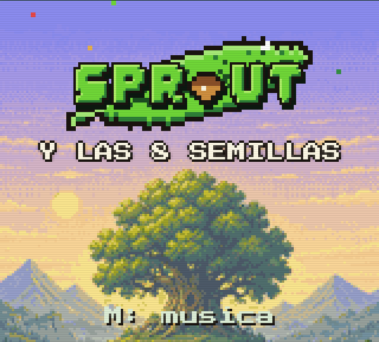

<div align="center">



# SPROUT · y las 8 semillas

**Un Zelda-like estilo Game Boy Color, hecho a mano con rectángulos.**

[](https://gavilanbe.github.io/sprout-game/)


</div>

---

## 🌱 Qué es esto

**SPROUT** es una aventura tipo *Link's Awakening* que corre en cualquier navegador.
Resolución real de Game Boy (160×144), tiles de 16 px, paleta GBC y banda sonora
*chiptune* generada en vivo con WebAudio. **Cero dependencias, cero paso de build**:
HTML, un `<canvas>` y JavaScript en módulos que se cargan en orden.

- **55 pantallas**: el Valle Raíz, las montañas del norte, las marismas del otoño,
  un glaciar, una cala escondida, cuevas secretas bajo los arbustos y **tres
  mazmorras** con llaves, puertas de guardián y puzles.
- **Tres guardianes que no mueren** (el Topo Real, la Reina Avispa y el Viento del
  Norte) y **tres minijefes** (el Escarabajo Rey, el Zángano Capitán y el Guardián
  de Hielo), cada uno con su truco.
- **Seis herramientas** — la Hoja Ancestral, la Bellota-bomba, la Raíz-gancho, la
  Vaina voladora, el Farol de brasa y el Vilano — y **nueve amuletos** equipables
  (dos a la vez) que cambian cómo juegas.
- **Backtracking de verdad**: cada herramienta reabre el valle (rocas agrietadas,
  islas, agujeros, cuevas oscuras) con corazones, cuartos de corazón y amuletos.
- **Puzles**: bloques sobre placas, pulsadores, antorchas que abren verjas,
  cristales que alternan bloques rojos y azules, hielo resbaladizo, llaves pequeñas
  y llaves grandes.
- **Lore**: un prólogo ilustrado, el diario del Roble (diez páginas), piedras
  rúnicas, libros en las estanterías, las cinco **Cartas del Viento** que nadie
  abrió y guardianes que siguen hablando después de la tregua. Todo se relee en
  la pestaña de Recuerdos.
- Tienda de Tilo, cabaña de Corteza, el pozo de los deseos, trueques con los
  vecinos, 19 tipos de bicho, clima por región y las cuatro estaciones girando
  al final.
- Zurrón con cinco pestañas (objetos y amuletos, mapa, el valle, recuerdos y
  ajustes), guardado en 3 ranuras con capítulo y tiempo, mandos táctiles,
  gamepad y PWA.

## 🎨 Arte

Todo el arte se genera en el arranque a partir de texto y rectángulos:

- **Autotiles**: el agua dibuja su orilla, los acantilados muestran cara y cornisa,
  los muros de mazmorra se biselan hacia las salas, los caminos y la arena se
  mezclan con la hierba.
- **Biomas**: primavera, verano, otoño, invierno y el valle mustio comparten mapas
  y cambian de paleta según la historia.
- Sprites de 16 px con contorno, dos fotogramas y poses de ataque y objeto en alto;
  minijefes de 24 px y guardianes de 32 px con retrato en el diálogo.
- Oscuridad con luz de farol y antorchas, sombras bajo cada actor, estelas de la
  Hoja, números de daño, sacudida de pantalla y *hit-stop*.

| La plaza del Gran Roble | El Topo Real |
|:--:|:--:|
|  |  |

| El sendero del pico | El Templo de la Cima |
|:--:|:--:|
|  |  |

| El zurrón | Corteza, la de los amuletos |
|:--:|:--:|
|  |  |

## 📖 La historia

El Viento del Norte robó las **8 semillas doradas** del Gran Roble y las esparció
por el valle. Sin ellas, todo el verdor se apaga. Eres **Sprout**, un brote recién
despierto en una maceta. Raíz, el anciano de la plaza, te manda a por la **Hoja
Ancestral**… y de ahí, a tres mazmorras donde duermen las reliquias de las
estaciones: la **Brasa de Primavera**, la **Lágrima de Verano** y el **Copo Eterno**.

**Ningún guardián muere.** Cuando se rinden, acércate y habla con Z. Y si vuelves
a visitarlos, tendrán algo que decirte.

## 🎮 Cómo se juega

| Tecla | Acción |
|---|---|
| `← ↑ ↓ →` / `WASD` | Mover |
| `Z` / espacio | Hoja · hablar · abrir · recoger |
| Mantener y soltar `Z` | Remolino (cuando lo aprendas de Tilo) |
| `X` | Usar el objeto equipado (bomba, gancho, vaina, farol, vilano) |
| `Enter` / `Escape` | Abrir y cerrar el zurrón |
| `X` en el zurrón | Cambiar de pestaña (zurrón · mapa · valle · recuerdos · ajustes) |
| `M` | Música on/off |

En el zurrón, `Z` sobre un objeto lo equipa en `X`; `Z` sobre un amuleto lo pone o
lo quita (dos ranuras). En móvil aparecen mandos táctiles. En mando: A = Z, B = X,
Start = zurrón.

## 🛠 Desarrollo

```sh
python3 -m http.server 8741    # cualquier estático vale
```

Sin build. El orden de los `<script>` de `index.html` es el orden de ejecución.
[ARCHITECTURE.md](ARCHITECTURE.md) explica los módulos y cómo añadir pantallas,
tiles, enemigos o misiones. [docs/DISEÑO.md](docs/DISEÑO.md) recoge la progresión,
los puzles y sus soluciones (spoilers).

Pruebas en navegador real (Playwright):

```sh
npm install && npx playwright install chromium && npm test
```

## 📜 Licencia

MIT. Hecho a mano con rectángulos por Nahuel Gavilán.
